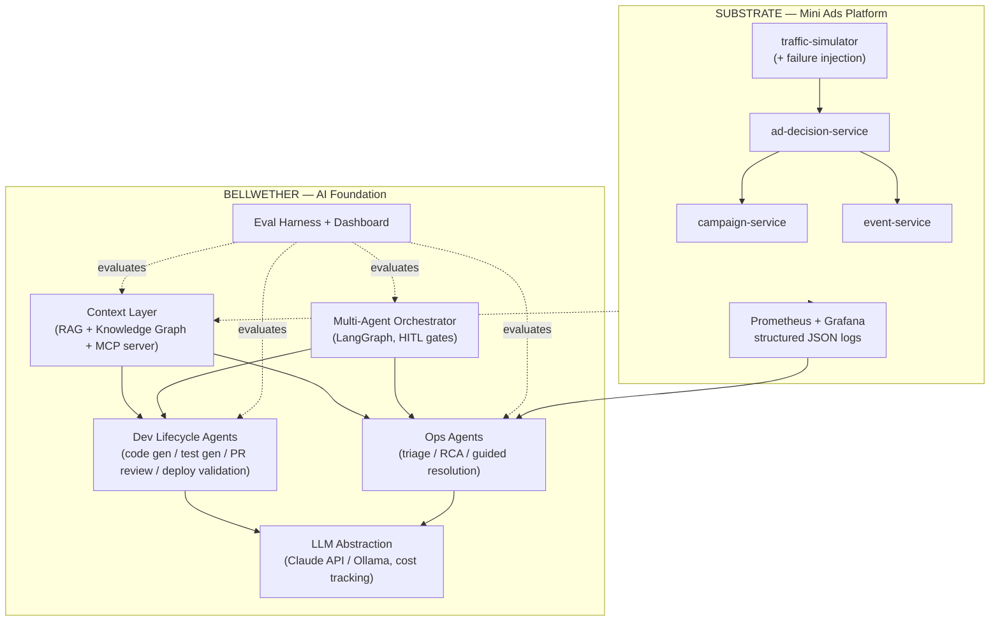

# BELLWETHER

**An AI-native engineering platform for ad-tech teams — built in public.**

<!-- CI badge added after first push to GitHub -->

## What is this?

BELLWETHER is a two-part system. The **Substrate** is a mini Netflix-style ads platform — four Python microservices (campaign management, ad decisioning, event tracking, traffic simulation) producing real traffic, structured logs, Prometheus metrics, and stageable incidents. **Bellwether** itself is the star: an AI foundation layer that operates on the substrate — a centralized context layer (RAG + knowledge graph), development lifecycle agents (code gen, test gen, PR pre-review, deployment validation), operational intelligence agents (incident triage, root cause analysis, guided resolution), a multi-agent orchestrator, and an evaluation harness.

The thesis: **AI velocity with provable quality.** Agentic tooling is easy to demo and hard to trust. Every AI capability in this repo ships with numeric evaluations — retrieval relevance scores, seeded-bug catch rates, RCA accuracy — so speed never outruns accountability.

This project is being built in public over 30 days, one deliverable per day, with a daily video series. <!-- video series link TBA -->

## The name

**bellwether** *(noun)* — a leading indicator; the thing you watch to know where something is heading before the rest of the picture catches up. Analysts watch bellwether stocks, forecasters watch bellwether districts.

That is the job, twice over. The first AI engineer on a team is a leading indicator of how that team will build a year from now. And the eval scoreboard is a leading indicator of whether the agents are actually making the work better — measured early, while there is still time to change course.

## Architecture



## The 30-day roadmap

| Level | Days | Theme |
|---|---|---|
| 0 | 1–5 | The Substrate — mini ads platform, observability, failure-injecting traffic simulator |
| 1 | 6–10 | Context Layer — ingestion, embeddings, hybrid retrieval, AST knowledge graph, MCP server |
| 2 | 11–15 | Dev Lifecycle Agents — code gen, test gen + mutation testing, PR pre-review, deploy validation |
| 3 | 16–20 | Ops Agents — log intelligence, triage, RCA, guided resolution, self-healing loop |
| 4 | 21–25 | Orchestration — agent protocol, parallel execution, conflict resolution, HITL, Actor-Critic evals |
| 5 | 26–30 | Platform & Launch — AI-first dev env, CI/CD AI gates, eval dashboard, grand demo, launch |

## Status

**Day 3** — Level 0 in progress.

- [x] Day 1 — repo scaffolding, ADR-0001, infra skeleton, running doc v1, CI
- [x] Day 2 — campaign-service
- [x] Day 3 — ad-decision-service
- [ ] Day 4 — event-service + observability
- [ ] Day 5 — traffic-simulator + failure injection

## Quickstart

```bash
uv sync --group dev          # install toolchain
uv run pytest                # run tests
docker compose up -d --build # start the stack
```

| Service | URL |
|---|---|
| campaign-service API docs | http://localhost:8001/docs |
| ad-decision-service API docs | http://localhost:8002/docs |
| Prometheus | http://localhost:9090 |
| Grafana | http://localhost:3000 |

Postgres is published on host port 5433 and Redis on 6380, so the stack does not
collide with other local database instances.

## Docs

- [Design specification](docs/superpowers/specs/2026-07-20-bellwether-design.md)
- [Architecture Decision Records](docs/adr/)
- [Running doc (living explainer with diagrams)](docs/site/index.html)
- [Daily devlog](docs/devlog/)

## Disclaimer

BELLWETHER is an independent open-source project, not affiliated with or endorsed by Netflix.
