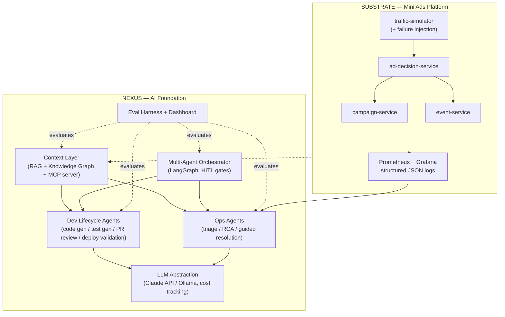
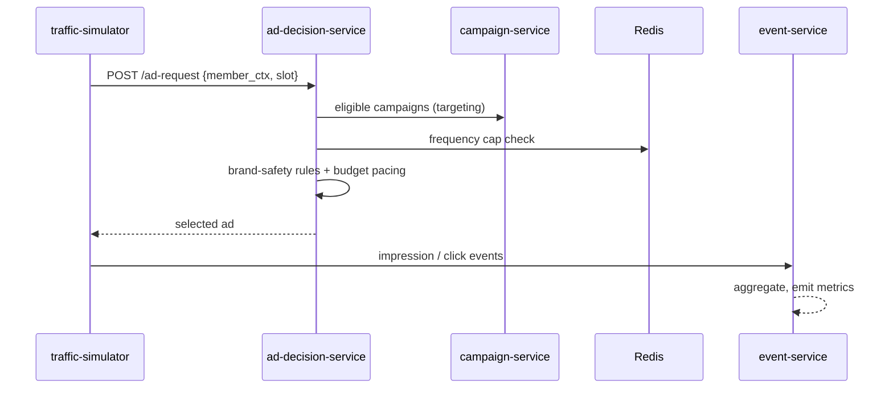

# ADS-NEXUS — Design Specification

**Date:** 2026-07-20
**Status:** Approved design, pending implementation plan
**Target:** Netflix Staff AI Engineer — AI Foundation & Tooling, Ads Platform (Req AJRT30201)

---

## 1. Mission

Build **ADS-NEXUS**: an open-source, production-grade, AI-native engineering platform that mirrors every capability in Netflix job posting AJRT30201 — built in public over ~30 days with daily YouTube videos.

The narrative: *"I built a small Netflix-style ads platform, then made the team that runs it AI-native."*

The differentiator: **AI velocity with provable quality.** The posting's core tension is "shipping faster without accumulating slop, regressions, or accountability gaps." Most portfolio projects demo flashy agents with no evaluation. ADS-NEXUS ships numeric evals with every level.

### The five pillars of the posting (all must have working, demoable counterparts)

1. **Centralized context layer** — RAG over team-specific knowledge, grounding all agents
2. **Dev lifecycle agents** — code gen, automated test creation, PR pre-review, deployment validation
3. **Ops agents** — incident triage, log/metric correlation, RCA, guided resolution
4. **Multi-agent orchestration** — parallel coordinated agents with human-in-the-loop
5. **Evaluation frameworks** — proving it works; evals woven into every level, not bolted on

---

## 2. System overview

Two-part system:

- **The Substrate** (`substrate/`) — a mini Netflix-style ads platform: 4 Python/FastAPI microservices producing real traffic, structured logs, Prometheus metrics, and stageable incidents. Exists so the AI layer has something real to operate on. Ops demos are real, not mock-data theater.
- **The AI Foundation** (`nexus/`) — the star: context layer, dev agents, ops agents, orchestrator, LLM abstraction, eval harness.



---

## 3. The Substrate (Level 0)

Four services, deliberately small but production-shaped:

| Service | Responsibility | Storage |
|---|---|---|
| **campaign-service** | Campaigns, creatives, budgets, targeting rules (CRUD) | Postgres |
| **ad-decision-service** | Core path: ad request (member context + slot) → targeting → frequency capping → brand-safety rules → budget pacing → ad selection | Redis (freq caps), calls campaign-service |
| **event-service** | Ingests impressions/clicks, aggregates, emits metrics | Postgres |
| **traffic-simulator** | Realistic ad-request load with **injectable failure modes**: latency spikes, error bursts, bad-config deploys, budget runaway | — |



**Infra:** Docker Compose (deliberately NOT Kubernetes — right-sized; rationale in ADR-0001), Postgres, Redis, structured JSON logging (shared logging lib), Prometheus + Grafana (REAL, not mocked — real dashboards during incident demos), OpenAPI on every service.

**Domain language matters:** ad insertion, brand safety, frequency capping, pacing — use the posting's vocabulary in code, docs, and videos.

---

## 4. The AI Foundation

### 4.1 Level 1 — Context Layer

- **Ingestion pipeline:** code, ADRs, runbooks, OpenAPI specs, devlogs, README docs
- **Chunking:** code-aware (AST-based for Python) + markdown-aware; documented strategy comparison
- **Embeddings:** local `sentence-transformers` default (free dev); hosted embeddings swappable behind interface
- **Retrieval:** hybrid (vector + BM25 keyword) with reranking; source citations mandatory in all agent outputs
- **Knowledge graph:** AST parsing → entities (services, endpoints, models, dependencies) → graph; powers "what depends on X" queries and diagram generation
- **Vector store:** ChromaDB local. No Pinecone — cost/friction for zero demo value at this corpus size (ADR)
- **Exposure:** **MCP server** — so Claude Code, agents, and any MCP client can query team knowledge

### 4.2 Level 2 — Dev Lifecycle Agents

- **Code-gen agent:** reads context layer, generates code + rationale, follows written team standards doc
- **Test-gen agent:** pytest generation + **mutation testing** to prove tests actually catch bugs (the "no slop" proof)
- **PR pre-review agent:** GitHub Actions integration; reviews diffs grounded in context layer + standards; risk scoring; seeded-bug catch-rate eval
- **Deployment-validation agent:** post-deploy smoke checks + log scan + rollback recommendation

### 4.3 Level 3 — Ops Agents

- **Log intelligence:** structured log parsing, pattern extraction
- **Incident triage:** alert correlation, severity classification
- **RCA agent:** correlates logs + metrics across services, produces RCA report **with cited evidence**
- **Guided resolution:** step-by-step remediation, runbook generation
- Demo loop: simulator injects failure → Grafana shows it → agent triages → RCA with evidence → guided fix

### 4.4 Level 4 — Multi-Agent Orchestration

- **LangGraph** state machines; LangChain kept minimal (thin, readable custom layers elsewhere — judgment over framework-following, ADR)
- Agent communication protocol: message schema, shared state
- Parallel execution: implement / test / document agents coordinated on one feature request
- Conflict resolution + human escalation
- **Human-in-the-loop approval gates** throughout
- **Actor-Critic / process-audit evaluation pattern** (extends Netflix's published agentic causal-inference work) as capstone

### 4.5 Level 5 — Platform & Launch

- Dev container + one-command setup (`<10 min` fresh-clone-to-running quality gate)
- CI/CD with AI gates (GitHub Actions: lint, tests, AI PR review, eval regression checks)
- Consolidated **eval dashboard**
- Grand demo: feature request → orchestrated agents → reviewed PR → validated deploy, end to end
- Launch day: open-source release + outreach

### 4.6 Cross-cutting: LLM abstraction

Thin provider interface (ADR): **Claude API** (cheap fast model — Haiku-class — for dev/testing; stronger model for recorded demos) + **Ollama** backend for free local iteration. Structured outputs everywhere. **Per-call token/cost tracking** built in — an accountability feature and demo point. No model names hardcoded in logic (2-years-stale model names in a portfolio repo signal copy-paste planning).

---

## 5. The 30-day build sequence

Timeline: ~6 weeks near-full-time. Videos daily per user's separate video plan; each day yields a video-sized deliverable. Video titles from the strategic plan are adopted (shifted +5 days for Levels 1+).

### Level 0 — The Substrate (Days 1–5)
| Day | Deliverable |
|---|---|
| 1 | Repo, architecture docs, README, **HTML running doc v1** (site skeleton + system diagrams), ADR-0001 |
| 2 | campaign-service (CRUD, Postgres, tests, OpenAPI) |
| 3 | ad-decision-service (targeting, freq capping, brand safety, pacing) |
| 4 | event-service + observability stack (Prometheus, Grafana dashboards, JSON logging lib) |
| 5 | traffic-simulator + failure injection; Level 0 quality gate |

### Level 1 — Context Layer (Days 6–10)
| Day | Deliverable |
|---|---|
| 6 | Document ingestion pipeline |
| 7 | Chunking + embedding strategies (comparison documented) |
| 8 | Hybrid retrieval + reranking |
| 9 | AST knowledge graph + visualization |
| 10 | MCP server + retrieval eval suite; quality gate |

### Level 2 — Dev Lifecycle Agents (Days 11–15)
| Day | Deliverable |
|---|---|
| 11 | Code-generation agent |
| 12 | Test-generation agent + mutation testing |
| 13 | PR pre-review agent (GitHub Actions) |
| 14 | Deployment-validation agent |
| 15 | E2E pipeline: ticket → code → test → PR → deploy; quality gate |

### Level 3 — Ops Agents (Days 16–20)
| Day | Deliverable |
|---|---|
| 16 | Log intelligence pipeline |
| 17 | Incident triage agent |
| 18 | RCA agent |
| 19 | Guided resolution + runbook generation |
| 20 | Self-healing loop E2E demo; quality gate |

### Level 4 — Orchestration (Days 21–25)
| Day | Deliverable |
|---|---|
| 21 | Agent communication protocol |
| 22 | Parallel agent execution |
| 23 | Conflict resolution + escalation |
| 24 | Human-in-the-loop gates |
| 25 | Actor-Critic process-audit evals; quality gate |

### Level 5 — Platform & Launch (Days 26–30)
| Day | Deliverable |
|---|---|
| 26 | AI-first dev environment (devcontainer, one-command setup) |
| 27 | CI/CD AI gates |
| 28 | Consolidated eval dashboard |
| 29 | Grand demo (feature E2E through the whole platform) |
| 30 | Launch: open-source release, outreach kickoff |

---

## 6. Quality gates & evaluation framework

Evaluation-Driven Development: metrics defined before each level is built.

| Level | Metric | Target |
|---|---|---|
| L0 | All services healthy under simulator load; failure injection works | 100% |
| L1 | Context relevance on 50-query synthetic dataset | >85% |
| L1 | Retrieval latency | <500ms |
| L2 | Generated code compiles / passes lint+types | 100% |
| L2 | Generated test pass rate; mutation score improvement | >90% |
| L2 | PR reviewer seeded-bug catch rate | measured & published |
| L3 | Synthetic incidents flagged | 5/5 |
| L3 | RCA correct root cause | >80% |
| L4 | Complex tasks completed by parallel agents | 3/3 |
| L4 | HITL approval acceptance rate | >90% |
| L5 | Fresh clone → running system | <10 min |
| L5 | CI/CD gates pass | 100% |

**Code quality standards:** Python 3.11+, type hints throughout, docstrings, pytest coverage >80%, pre-commit (ruff format + ruff + mypy), ADRs for major decisions, conventional commits.

---

## 7. The HTML running doc (first-class deliverable)

**Purpose:** the user's living explainer — used to understand the project and present it to others. "A picture speaks 1000 words."

- Lives at `docs/site/` → published via **GitHub Pages**
- **Every level gets in-depth diagrams:** architecture, sequence, data-flow, state machines — rendered with **Mermaid** (diagrams-as-code: versioned, maintainable, reusable in videos)
- Structure: hero/overview → live day tracker → one section per level (goal, architecture diagrams, key decisions, quality-gate results) → eval scoreboard
- Updated at the end of every build day (part of the daily definition-of-done)
- v1 ships Day 1 with the system-level diagrams; each level's section fills in as it's built

---

## 8. Repository structure

```
ads-nexus/
├── README.md
├── docker-compose.yml
├── pyproject.toml
├── docs/
│   ├── superpowers/specs/      # this spec, future plans
│   ├── adr/                    # architecture decision records
│   ├── devlog/                 # daily build log (video source material)
│   ├── runbooks/               # ops runbooks (context-layer fodder)
│   ├── standards/              # team coding standards (grounds PR reviewer)
│   └── site/                   # HTML running doc (GitHub Pages)
├── substrate/
│   ├── campaign-service/
│   ├── ad-decision-service/
│   ├── event-service/
│   ├── traffic-simulator/
│   └── shared/                 # logging lib, common models
├── nexus/
│   ├── llm/                    # provider abstraction + cost tracking
│   ├── context/                # ingestion, retrieval, KG, MCP server
│   ├── agents/
│   │   ├── dev/                # L2 agents
│   │   └── ops/                # L3 agents
│   ├── orchestrator/           # L4 LangGraph workflows
│   └── evals/                  # eval harness, datasets, dashboard
└── platform/                   # devcontainer, CI/CD workflows
```

Note: current directory is `Netflix-build_in_public`; the repo will be published to GitHub as `ads-nexus`.

---

## 9. Content & outreach strategy (from strategic plan, adopted)

**Video structure (15–25 min):** Hook (30s) → Problem context tied to Netflix Ads (2m) → Architecture diagrams (3m) → Focused live build (10m) → Working demo (3m) → Lessons learned (2m) → CTA (1m).

**Every video:** references AJRT30201, connects to Netflix's published agentic work, uses ads-domain language, addresses the speed-vs-quality tension.

**Outreach phases:** (1) Days 1–20 content seeding — LinkedIn daily, thoughtful engagement on Netflix Tech Blog, r/MachineLearning, HN, Discord. (2) Days 21–25 direct engagement — showcase thread, technical deep-dive article, newsletters. (3) Day 25+ application with project as portfolio + video playlist. (4) Ongoing: maintain project, accept contributions.

**Day 0 video:** "The Manifesto" — the idea, the job posting, the plan (this spec + running doc as visuals).

---

## 10. Risks

| Risk | Mitigation |
|---|---|
| Daily video burnout | Videos follow build; buffer days; 15–20 min max |
| Scope creep | Strict quality gates; no new features after gate passes |
| Technical blockers | Proven stack (FastAPI, LangGraph, ChromaDB); no experimental tech |
| LLM API costs | Ollama for iteration; Haiku-class for tests; strong models only for recorded demos; per-call cost tracking |
| Claude Code budget (~$10 then Opus 4.8) | This spec + per-level plans = cheap session memory; execution sessions never re-derive strategy |
| Netflix legal/trademark | Open source, no proprietary code, clear "not affiliated" disclaimers; project name is ADS-NEXUS, not Netflix-branded |

---

## 11. Success criteria

A Netflix Staff engineer skimming the repo for 10 minutes concludes: *this person has built agentic systems production-style, with evals, and communicates like a senior engineer.* Concretely:

1. Working demos of all 5 posting pillars
2. Published eval numbers on a dashboard
3. Documentation trail from requirements → design → running system (this spec, ADRs, devlogs, running doc)
4. <10-minute setup for anyone who clones it
